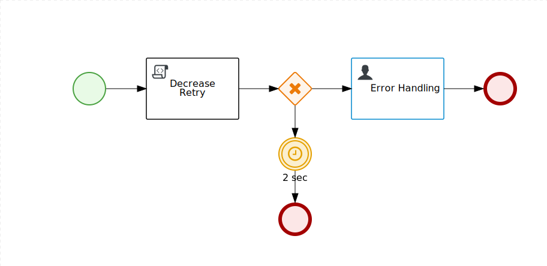

Error Handling Strategy
=======================

Usage example of error handling stragegies.

**This project can be imported in the Business Central**

To understand the motivation behind it see:

- [Reducing data inconsistencies with Red Hat Process Automation Manager](https://developers.redhat.com/blog/2018/08/22/reducing-data-inconsistencies-with-red-hat-process-automation-manager/)

The Error Handling strategy is a feature of the process engine that delegate a specific process to manage the exception raised by the main project:

Main process:

The REST call raise an exception that is handled by the following process:

The error handling process trigger a retry strategy 5 times after 2 seconds of delay, then it trigger a human task to manually remediate the error.
The human task can trigger two strategies:

- change the URL of the REST call and **retry**: potentially any feature of the failing service can changed by the user before retry.
- provide the result manually and **complete**: the main process will take the result provided by the user as the it came from REST call.