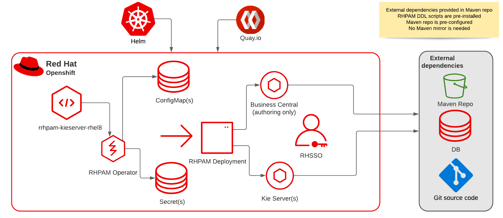
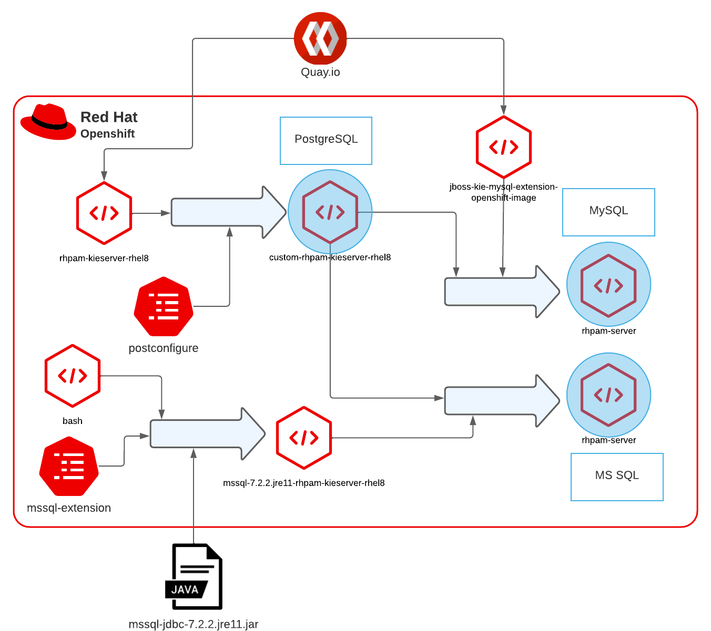

# Design notes

## Deployment Architecture
The following picture describes a sample architecture of an authoring or production environment in the OpenShift runtime:

## Design considerations
### RHPAM image generation process
Starting from the base `rhpam-kieserver-rhel8` image, the following images are generated by the deployment to accomodate
the different configurations:
* `custom-rhpam-kieserver-rhel8` to integrate the configured custom properties. This is also the final image in case of `PostgreSQL` database
* For `MySQL` database:
    * `custom-rhpam-kieserver-rhel8` is merged with the `jboss-kie-mysql-extension-openshift-image` from Quay.io to generate the
      final `rhpam-server` image
* For `MS SQL` database:
    * `mssql-7.2.2.jre11-rhpam-kieserver-rhel8` is generated from the `mssql-extension` ConfigMap and then merged with
      `custom-rhpam-kieserver-rhel8` to generate the final `rhpam-server` image

The following picture summarize the image generation process for any supported database:

