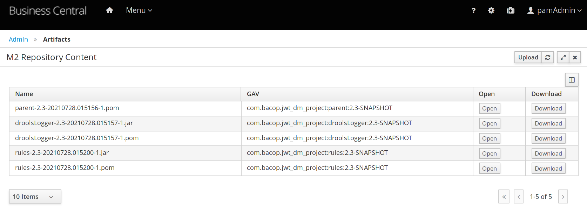

for gar look at master

bacopv1 is in sync with v1

mvn package will place JAR in modules directory

-- with no external service -- 

```
JASPI_USER_HEADER='userid'
JASPI_TOKEN_HEADER='token'
JASPI_ROLES_HEADER='roleslist'
JASPI_JWT_ALLOWANCE='302'
JASPI_ALLOW_PREFIX='/kie-server/services/rest/server/readycheck,/kie-server/services/rest/server/healthcheck'
JASPI_CERTIFICATE_LOCATION='${jboss.server.config.dir}/certificate_gar.pem'
JASPI_ALLOWED_SYSTEM='kie-server'
```

projects needed:
- JWT_JASPI implementation
- Drools project
- JWT token and certificates generator
- KIEServer deployment with JWT_JASPI module integration and EAP configuration for JASPI
- sample bash scripts to invoke Drools
- Java client to invoke drools
- OCP image builder

xkcd standards: https://xkcd.com/927/

Sequence:

- Install PAM.7.7.0/KIE-Server only using [pam-eap-setup](https://github.com/redhat-cop/businessautomation-cop/tree/master/deployment-examples/pam-eap-setup)


## Overview of demo

A locally installed KIE Server will be used to demonstrate JWT processing as a JASPI module.
The installation will be performed using [pam-eap-setup](https://github.com/redhat-cop/businessautomation-cop/tree/master/deployment-examples/pam-eap-setup). Two KIE Servers will be installed, one will be left unmodified and on the other the JWT processing module will be installed.

A sample Drools-based project will be deployed on both KIE Servers and will be invoked both with and without a JWT token.
The Drools project will be invoked with and without the JWT token to demonstrate the effect the JWT processing module has on invoking KIE Server endpoints.

An OCP image will be built incorporating the custom JWT processign module. Handling of liveness and health probes will need to be handled.


## Step 1 - Local install of KIE Servers

Installation will be based on [pam-eap-setup](https://github.com/redhat-cop/businessautomation-cop/tree/master/deployment-examples/pam-eap-setup) using the following :

```
../../deployment-examples/pam-eap-setup/pam-setup.sh -b multi=2
```

This will create the following set up on your local environment

```
+--------------------------------------------------+
| EAP                                              |
|                                                  |
| +--- standalone -------------+  +- node 2 -----+ |
| |+-----------+ +------------+|  |+------------+| |
| ||           | |            ||  ||            || |
| || Business  | | KIE Server ||  || KIE Server || |
| || Central   | |            ||  ||            || |
| ||           | |            ||  ||            || |
| |+-----------+ +------------+|  |+------------+| |
| +- :8080 --------------------+  +- :8180 ------+ |
|                                                  |
+--------------------------------------------------+
```

The custom JWT processing module will be installed on KIE Server on `node 2` (port 8180) while the KIE Server on the `standalone` node will be unmodified. Both KIE Servers will be controlled by a Business Central instance to demonstrate the effect of the custom JWT module in the "controlling" functionality.

To proceed with the installation, place the following files in the current directory:

- jboss-eap-7.2.0.zip
- jboss-eap-7.2.8-patch.zip (optional, though not [7.2.9])
- rhpam-7.7.1-kie-server-ee8.zip
- rhpam-7.7.1-business-central-eap7-deployable.zip

[7.2.9]: The [7.7.1.GA QE Sign-off document](https://source.redhat.com/groups/public/baqe/mojo_migrated/red_hat_business_automation_771ga_qe_sign_off) mentions Jboss EAP 7.2.8 as the version used and indeed it seems that with 7.2.9 there are some unresolved issues.

and execute the `demo_step1.sh` script
> The `demo_step1.sh` script will delete previous installations so re-running it will provide you with a clean start up environment

## Step 2 - Build and deploy dm_project

The `dm_project` is an unsophisticated RHDM project consisting of a Drools module, a rules event listener and a Java-based KIE client to invoke the Drools project.

Start the `standalone` node installed at "Step 1" using the `go_pam.sh` script and leave it running. Switch to another terminal and build the `dm_project` by invoking the `demo_step2.sh` script.

The `demo_step2.sh` script will build the `dm_project` and deposit the artefacts to the maven repository that is embedded in Business Central.

Upon successful completion you can check that the artefacts have been correctly deployed by logging in the Business Central and checking the embedded repository. You should see arterfacts similar to the following:




> Written with [StackEdit](https://stackedit.io/).

