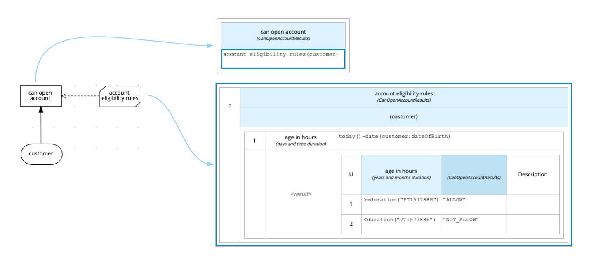

= DMN Example 1

This example show how use DMN to check if a Customer can open a bank account(is underage or not).

== Project 'dmn-example1-parent' details

=== Details

dmn-example1-model::
* Define all model
dmn-example1-services-api::
* Define the services API endpoint
dmn-example1-services-api-impl::
* Implements all services defined in *dmn-example1-services-api*

[cols="1,2,1,1", options="header"]
.Services
|===
|HTTP Method |URI |Request |Response

|POST
|/dmn-example-1/services/customer
|xref:dmn-example1-parent/dmn-example1-model/src/main/java/com/redhat/cop/pam/example1/Customer.java[Customer.java]
|xref:dmn-example1-parent/dmn-example1-model/src/main/java/com/redhat/cop/pam/example1/CanOpenAccountResults.java[CanOpenAccountResults.java]
|===

dmn-example1-kie-api::
* Define a method to invoke the DMN
dmn-example1-kie-api-embedded-impl::
* Show how invoke a DMN service embed in your application(Implements the methods defined in *dmn-example1-kie-api*)
dmn-example1-kie-api-remote-impl::
* Show how invoke a DMN service deployed on a remote kie-server(Implements the methods defined in *dmn-example1-kie-api*)
dmn-example1-kjar::
* Define the DMN used in the example

== Configure
IMPORTANT: To try the remote version you need an instance of kie-server up and running.
For installation and configuration please refer to the https://access.redhat.com/documentation/en-us/red_hat_process_automation_manager/7.7/[official documentation]

Create a user with role `kie-server`

[source,shell script]
----
# Linux and mac
$ ./add-user.sh -a --silent=true --user 'kieServerUser' --password 'kieServerUser1234;' --group 'kie-server'
# Windows
$ add-user.bat -a --silent=true --user 'kieServerUser' --password 'kieServerUser1234;' --group 'kie-server'
----

If a different user or password has been used  the system properties in xref:https://github.com/redhat-cop/businessautomation-cop/blob/master/pam-quick-examples/dmn-example1/dmn-example1-parent/pom.xml#L168[pom.xml] need to be update
[source,xml]
----
<properties>
   <remote.kieserver_url>http://localhost:8080/kie-server/services/rest/server</remote.kieserver_url>
   <remote.kieserver_user>kieServerUser</remote.kieserver_user>
   <remote.kieserver_password>kieServerUser1234;</remote.kieserver_password>
   <remote.kieserver_containerid>com.redhat.cop.pam:dmn-example1-kjar:1.0</remote.kieserver_containerid>
</properties>
----

== Build, Test, Run
[cols="1,1,3,4", options="header"]
|===
|Runtime |Configuration |Build and Test |Run

|quarkus
|embedded
|`$ mvn install -Pquarkus,embedded`
a|
[source,shell]
----
$ java -jar dmn-example1-quarkus/target/dmn-example1-quarkus-1.0-runner.jar
----
|quarkus
|remote
|`$ mvn install -Pquarkus,remote`
a|
[source,shell]
----
$ java \
"-Dcom.redhat.cop.pam.kieserver_url=http://localhost:8080/kie-server/services/rest/server" \
"-Dcom.redhat.cop.pam.kieserver_user=kieServerUser" \
"-Dcom.redhat.cop.pam.kieserver_password=kieServerUser1234;" \
"-Dcom.redhat.cop.pam.kieserver_containerid=com.redhat.cop.pam:dmn-example1-kjar:1.0" \
-jar dmn-example1-quarkus/target/dmn-example1-quarkus-1.0-runner.jar
----
|springboot
|embedded
|`$ mvn install -Pspringboot,embedded`
a|
[source,shell]
----
$ cd dmn-example1-springboot/
$ mvn spring-boot:run -Pspringboot,embedded
----

|springboot
|remote
|`$ mvn install -Pspringboot,remote`
a|
[source,shell]
----
$ cd dmn-example1-springboot/
$ mvn spring-boot:run -Pspringboot,remote
----
|===

check all test passed::
* quarkus: xref:dmn-example1-parent/dmn-example1-quarkus/src/test/java/com/redhat/cop/pam/example1/quarkus/ServiceTest.java[ServiceTest.java]
* spring-boot: xref:dmn-example1-parent/dmn-example1-springboot/src/test/java/com/redhat/cop/pam/example1/springboot/ServiceTest.java[ServiceTest.java]

== Try it
Using https://www.postman.com/[postman] import xref:postman-collections/dmn-example-1.postman_collection.json[dmn-example-1.postman_collection.json]

[cols="1,3,3,1", options="header"]
|===
|HTTP Method |URI |Request |Response

|POST
|http://localhost:8280/dmn-example-1/services/customer
a|
[source,json]
----
{
    "name": "Donald",
    "surname" : "Duck",
    "dateOfBirth" : "1870-06-09"
}
----
|ALLOW

|POST
|http://localhost:8280/dmn-example-1/services/customer
a|
[source,json]
----
{
    "name": "Young",
    "surname" : "Rossi",
    "dateOfBirth" : "2020-01-20"
}
----
|NOT_ALLOW
|===