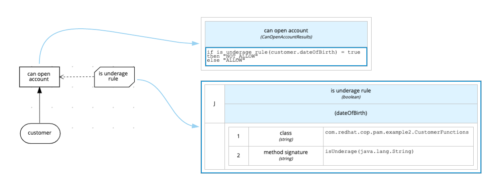

= DMN Example 2

This example show how invoke a java function from DMN to check if a Customer can open a bank account(is underage or not).

== Project 'dmn-example2-parent' details

=== Details

dmn-example2-model::
* Define all model
dmn-example2-functions::
* Contains the xref:dmn-example2-parent/dmn-example2-functions/src/main/java/com/redhat/cop/pam/example2/CustomerFunctions.java[function] that will be invoked from DMN in this example
```java
public class CustomerFunctions {

    private static final Logger LOGGER = LoggerFactory.getLogger(CustomerFunctions.class);

    private static final DateTimeFormatter FORMATTER = DateTimeFormatter.ofPattern("yyyy-MM-d");

    public static boolean isUnderage(final String dateOfBirth){
        final long age = ChronoUnit.YEARS.between(LocalDate.parse(dateOfBirth, FORMATTER), LocalDate.now());
        LOGGER.info("Customer is: {}", (age < 18 ? "underage" : "adult"));
        return age < 18l;
    }
}
```

dmn-example2-services-api::
* Define the services API endpoint
dmn-example2-services-api-impl::
* Implements all services defined in *dmn-example2-services-api*

[cols="1,2,1,1", options="header"]
.Services
|===
|HTTP Method |URI |Request |Response

|POST
|/dmn-example-2/services/customer
|xref:dmn-example2-parent/dmn-example2-model/src/main/java/com/redhat/cop/pam/example2/Customer.java[Customer.java]
|xref:dmn-example2-parent/dmn-example2-model/src/main/java/com/redhat/cop/pam/example2/CanOpenAccountResults.java[CanOpenAccountResults.java]
|===

dmn-example2-kie-api::
* Define a method to invoke the DMN
dmn-example2-kie-api-embedded-impl::
* Show how invoke a DMN service embed in your application(Implements the methods defined in *dmn-example2-kie-api*)
dmn-example2-kie-api-remote-impl::
* Show how invoke a DMN service deployed on a remote kie-server(Implements the methods defined in *dmn-example2-kie-api*)

=== Build
```bash
$ cd dmn-example2-parent/
$ mvn clean install
```

== Project 'dmn-example2-kjar'

=== Details



=== Build
```bash
$ cd dmn-example2-kjar/
$ mvn clean install
```

== Run it

=== Embedded

==== Quarkus
```bash
$ cd dmn-example2-quarkus-embedded/
$ mvn clean install
```
TIP: check all test passed xref:dmn-example2-quarkus-embedded/src/test/java/com/redhat/cop/pam/example2/quarkus/ServiceTest.java[ServiceTest.java]
```bash
$ ./mvnw compile quarkus:dev
```

==== Spring boot
```bash
$ cd dmn-example2-springboot-embedded/
$ mvn clean install
```
TIP: check all test passed xref:dmn-example2-springboot-embedded/src/test/java/com/redhat/cop/pam/example2/springboot/ServiceTest.java[ServiceTest.java]
```bash
$ ./mvn spring-boot:run
```
=== Remote
IMPORTANT: To try the remote version you need an instance of kie-server up and running.
For installation and configuration please refer to the https://access.redhat.com/documentation/en-us/red_hat_process_automation_manager/7.7/[official documentation]

Create a user with role `kie-server` and update the properties in xref:dmn-example2-parent/dmn-example2-kie-api-remote-impl/src/main/java/com/redhat/cop/pam/example2/kie/api/impl/RulesApiImpl.java[RulesApiImpl.java]
```java
    private static final String URL = System.getProperty("com.redhat.cop.pam.kieserver_url", "http://localhost:8080/kie-server/services/rest/server");
    private static final String USER = System.getProperty("com.redhat.cop.pam.kieserver_user", "kieServerUser");
    private static final String PASSWORD = System.getProperty("com.redhat.cop.pam.kieserver_password", "kieServerUser1234;");
```
or define the system property you need to override

* `com.redhat.cop.pam.kieserver_url`
* `com.redhat.cop.pam.kieserver_user`
* `com.redhat.cop.pam.kieserver_password`

On kie-server deploy the kjar com.redhat.cop.pam:dmn-example2-kjar:1.0
```xml
<release-id>
    <artifact-id>dmn-example2-kjar</artifact-id>
    <group-id>com.redhat.cop.pam</group-id>
    <version>1.0</version>
</release-id>
```
==== Quarkus
```bash
$ cd dmn-example2-quarkus-remote/
$ mvn clean install
```
TIP: check all test passed xref:dmn-example2-quarkus-remote/src/test/java/com/redhat/cop/pam/example2/quarkus/ServiceTest.java[ServiceTest.java]
```bash
$ ./mvnw compile quarkus:dev
```

==== Spring boot
```bash
$ cd dmn-example2-springboot-remote/
$ mvn clean install
```
TIP: check all test passed xref:dmn-example2-springboot-remote/src/test/java/com/redhat/cop/pam/example2/springboot/ServiceTest.java[ServiceTest.java]
```bash
$ ./mvn spring-boot:run
```

== Try it
Using https://www.postman.com/[postman] import xref:postman-collections/dmn-example-2.postman_collection.json[dmn-example-2.postman_collection.json]

[cols="1,3,3,1", options="header"]
|===
|HTTP Method |URI |Request |Response

|POST
|http://localhost:8280/dmn-example-2/services/customer
|
```json
{
    "name": "Donald",
    "surname" : "Duck",
    "dateOfBirth" : "1870-06-09"
}
```
|ALLOW

|POST
|http://localhost:8280/dmn-example-2/services/customer
|
```json
{
    "name": "Young",
    "surname" : "Rossi",
    "dateOfBirth" : "2020-01-20"
}
```
|NOT_ALLOW
|===