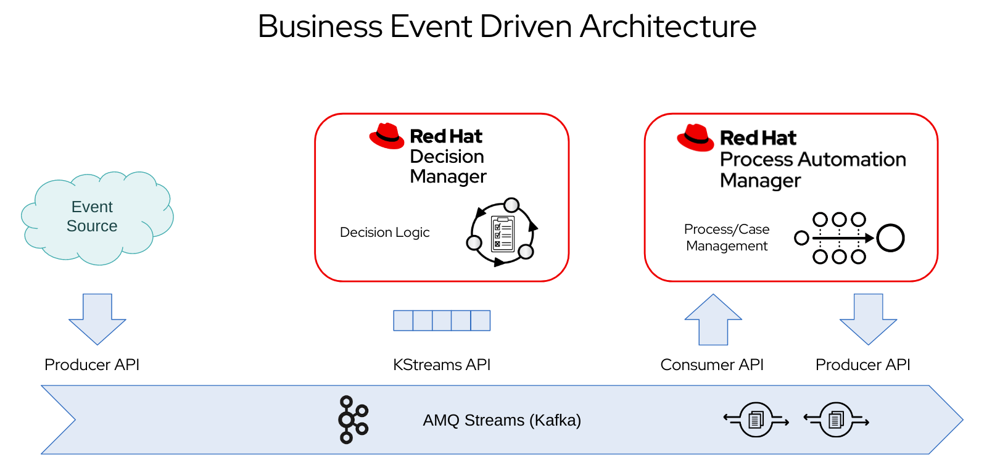

Business Event Driven Architecture Demo
==========================================

Simple demo of a decision and a case definition that are "event driven".

This repository contains a simple project for **Red Hat Process Automation Manager** (productized version of jBPM).

It's just a part of a full picture where a decision is triggered by incoming events coming from a Kafka backbone.

The outcome of the decision potentially triggers other events that could start a case.

Finally, the case engine receives other events that make case instance progress through its life cycle.

