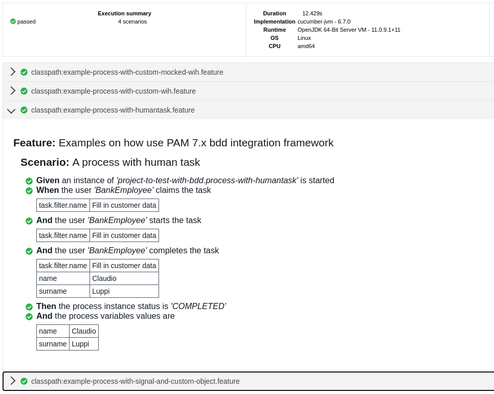

:link-framework-source-code: https://github.com/redhat-cop/businessautomation-cop/tree/master/testing-examples/bdd-pam-framework/pam-bdd-parent[pam-bdd-parent]

# project-to-test-with-bdd-parent

Show how to write bdd test for a kjar using bdd-pam-framework

## Pre requisite

The bdd framework "pam-bdd-parent" have to be available in you maven repository

Source code available at {link-framework-source-code}

## Example overview 

- <<BDD Scenario 1 - process with human task>>
- <<BDD Scenario 2 - process with signal and custom object>>
- <<BDD Scenario 3 - process with custom work item handler>>
- <<BDD Scenario 4 - process with custom work item handler mock>>

## Project structure overview

- project-to-test-with-bdd: is the kjar to test
- project-to-test-with-bdd-junit-test: Contains the bdd scenarios to test the process
- project-to-test-with-bdd-test-model: Contains the custom object used by the KJAR
- project-to-test-with-bdd-wih: Contains the custom work item handler used by the KJAR

## BDD Scenario 1 - process with human task

This example show how test the process definition xref:project-to-test-with-bdd/src/main/resources/com/redhat/examples/bdd/process/process-with-humantask.bpmn[project-to-test-with-bdd.process-with-humantask] using the bdd-pam-framework.

image::project-to-test-with-bdd/src/main/resources/com/redhat/examples/bdd/process/project-to-test-with-bdd.process-with-humantask-svg.svg[]

### Test the process
. Create an implementation of `com.redhat.pam.guice.BDDCustomContextProvider`, this interface declare a method get() that return an instance of `com.redhat.pam.bdd.context.BDDContext`.
To create an instance of BDDContext we first need a RuntimeManager, bdd-pam-framework define a facility class(com.redhat.pam.runtime.BDDEmbeddedRuntime) that does most of the work for us, the only action needed is to implement the abstract method `getUserGroupCallback()`. In our example the human task is assigned to the members of the group 'BANK.EMPLOYEE' the implementation of the method will be like:

[source,java]
----
    @Override
    public UserGroupCallback getUserGroupCallback() {
        final Properties properties = new Properties();
        properties.put("BankEmployee", "BANK.EMPLOYEE");
        return new JBossUserGroupCallbackImpl(properties);
    }
----

Once done to get the RuntimeManager just invoke one of the method provided by the facility class:

[source,java]
----
    public RuntimeManager getRuntimeManager(final ReleaseId releaseId);
    public RuntimeManager getRuntimeManager(final String gav);
    public RuntimeManager getRuntimeManager(final ReleaseId releaseId, final String kieBase, final String kieSession);
----

Now that the RuntimeManager is ready we can create an instance of BDDContext using the constructor cof the class

[source,java]
----
    public BDDContext(final RuntimeManager runtimeManager);
----

The full code of the ContextProvider implementation will look like:

[source,java]
----
    import com.redhat.pam.bdd.context.BDDContext;
    import com.redhat.pam.guice.BDDCustomContextProvider;
    import com.redhat.pam.runtime.BDDEmbeddedRuntime;
    import org.jbpm.services.task.identity.JBossUserGroupCallbackImpl;
    import org.kie.api.KieServices;
    import org.kie.api.builder.ReleaseId;
    import org.kie.api.task.UserGroupCallback;
    import org.kie.internal.runtime.manager.context.ProcessInstanceIdContext;

    import java.util.Properties;

    public class ContextProvider implements BDDCustomContextProvider {
        
        @Override
        public BDDContext get() {
    
            final BDDEmbeddedRuntime embeddedRuntime = new BDDEmbeddedRuntime() {
                @Override
                public UserGroupCallback getUserGroupCallback() {
                    final Properties properties = new Properties();
                    properties.put("BankEmployee", "BANK.EMPLOYEE");
                    return new JBossUserGroupCallbackImpl(properties);
                }
            };

            return new BDDContext(embeddedRuntime.getRuntimeManager("com.redhat.pam.bdd.examples:project-to-test-with-bdd:1.0"));
        }
    }
----

[start=2]
. Add the Java Service Provider configuration file xref:project-to-test-with-bdd-junit-test/src/test/resources/META-INF/services/com.redhat.pam.guice.BDDCustomContextProvider[com.redhat.pam.guice.BDDCustomContextProvider] the content must be the fully qualified name of the class created in the previous step

[start=3]
. Create the bdd scenario. 
The xref:project-to-test-with-bdd-junit-test/src/test/resources/example-process-with-humantask.feature[example-process-with-humantask.feature] contains the scenario to test the process, because we use only the steps defined in the bdd-pam-framework there's no need to write the step implementation:

[source,text]
----
    Feature: Examples on how use PAM 7.x bdd integration framework

    Scenario: A process with human task
        Given an instance of 'project-to-test-with-bdd.process-with-humantask' is started
        When the user 'BankEmployee' claims the task
        |task.filter.name|Fill in customer data |
        And the user 'BankEmployee' starts the task
        |task.filter.name|Fill in customer data |
        And the user 'BankEmployee' completes the task
        |task.filter.name|Fill in customer data |
        |name            |Claudio               |
        |surname         |Luppi                 |
        Then the process instance status is 'COMPLETED'
        And the process variables values are
        |name   |Claudio |
        |surname|Luppi   |
----

[start=4]
. BDD Runner
Create a class that extends `com.redhat.pam.bdd.runner.BDDRunner` defined in the bdd-pam-framework

[source,java]
----
import io.cucumber.junit.Cucumber;
import io.cucumber.junit.CucumberOptions;
import com.redhat.pam.bdd.runner.BDDRunner;
import com.redhat.pam.guice.CustomObjectFactory;
import org.junit.runner.RunWith;

@RunWith(Cucumber.class)
@CucumberOptions(
        features = {
                "classpath:example-process-with-humantask.feature"
        }
)
public class ExampleBDDRunnerTest extends BDDRunner {
}
----

[start=5]
. Run the example

[source,bash]
----
$ mvn clean install
----

## BDD Scenario 2 - process with signal and custom object

This example show how test the process definition xref:project-to-test-with-bdd/src/main/resources/com/redhat/examples/bdd/process/process-with-signal-and-custom-object.bpmn[project-to-test-with-bdd.process-with-signal] using the bdd-pam-framework.

image::project-to-test-with-bdd/src/main/resources/com/redhat/examples/bdd/process/project-to-test-with-bdd.process-with-signal-svg.svg[]

### Test the process
. Create an implementation of `com.redhat.pam.guice.BDDCustomContextProvider`, this interface declare a method get() that return an instance of `com.redhat.pam.bdd.context.BDDContext`.
To create an instance of BDDContext we first need a RuntimeManager, bdd-pam-framework define a facility class(com.redhat.pam.runtime.BDDEmbeddedRuntime) that does most of the work for us, the only action needed is to implement the abstract method `getUserGroupCallback()`. In our example the human task is assigned to the members of the group 'BANK.EMPLOYEE' the implementation of the method will be like:

[source,java]
----
    @Override
    public UserGroupCallback getUserGroupCallback() {
        final Properties properties = new Properties();
        properties.put("BankEmployee", "BANK.EMPLOYEE");
        return new JBossUserGroupCallbackImpl(properties);
    }
----

Once done to get the RuntimeManager just invoke one of the method provided by the facility class:

[source,java]
----
    public RuntimeManager getRuntimeManager(final ReleaseId releaseId);
    public RuntimeManager getRuntimeManager(final String gav);
    public RuntimeManager getRuntimeManager(final ReleaseId releaseId, final String kieBase, final String kieSession);
----

Now that the RuntimeManager is ready we can create an instance of BDDContext using the constructor cof the class

[source,java]
----
    public BDDContext(final RuntimeManager runtimeManager);
----

The full code of the ContextProvider implementation will look like:

[source,java]
----
    import com.redhat.pam.bdd.context.BDDContext;
    import com.redhat.pam.guice.BDDCustomContextProvider;
    import com.redhat.pam.runtime.BDDEmbeddedRuntime;
    import org.jbpm.services.task.identity.JBossUserGroupCallbackImpl;
    import org.kie.api.KieServices;
    import org.kie.api.builder.ReleaseId;
    import org.kie.api.task.UserGroupCallback;
    import org.kie.internal.runtime.manager.context.ProcessInstanceIdContext;

    import java.util.Properties;

    public class ContextProvider implements BDDCustomContextProvider {
        
        @Override
        public BDDContext get() {
    
            final BDDEmbeddedRuntime embeddedRuntime = new BDDEmbeddedRuntime() {
                @Override
                public UserGroupCallback getUserGroupCallback() {
                    final Properties properties = new Properties();
                    properties.put("BankEmployee", "BANK.EMPLOYEE");
                    return new JBossUserGroupCallbackImpl(properties);
                }
            };

            return new BDDContext(embeddedRuntime.getRuntimeManager("com.redhat.pam.bdd.examples:project-to-test-with-bdd:1.0"));
        }
    }
----

[start=2]
. Add the Java Service Provider configuration file xref:project-to-test-with-bdd-junit-test/src/test/resources/META-INF/services/com.redhat.pam.guice.BDDCustomContextProvider[com.redhat.pam.guice.BDDCustomContextProvider] the content must be the fully qualified name of the class created in the previous step

[start=3]
. Custom object parameter
The signal 'id_document_received' defined in the process definition expect an instance of xref:project-to-test-with-bdd-test-model/src/main/java/com/redhat/examples/bdd/process/Document.java[Document.java] as input parameter. The bdd-pam-framework define a simple way to use custom object

[TIP] 
====
If inside a Datatable a cell match the regular expression
[source,java]
----
(?<path>(?:[^;]*\/))?(?<prefix>(?:[^;]*-))?(?<className>.+?(?=\.json))
----
the cell value is replaced with an instance of the object stored in the provided json file.

The regualr expression define 3 groups:

- path(optional): rapresent the path of the file that contains the json rapresentaion of the instance to create.
- prefix(optional): rapresent a mnemonic prefix that can be add to the filename. If present need to end with the char '-'
- className: the fully qualified name of the class of the object to be created
====

To take advantage of this just create a file example-custom-object-com.redhat.examples.bdd.process.Document.json int the test/resources/data folder and put the json rapresentation of the instance as content

[source,json]
----
{
  "documentType" : "Driving License",
  "documentId" : "Document-0001"
}
----
Everytime in the feature file we need to refer to the instance of Document created we just need to write 'data/example-custom-object-com.redhat.examples.bdd.process.Document.json' as DataTable cell value

[start=4]
. Create the bdd scenario. 
The xref:project-to-test-with-bdd-junit-test/src/test/resources/example-process-with-signal-and-custom-object.feature[example-process-with-signal-and-custom-object.feature] contains the scenario to test the process, because we use only the steps defined in the bdd-pam-framework there's no need to write the step implementation:

[source,text]
----
    Feature: Examples on how use PAM 7.x bdd integration framework

    Scenario: A process with human task, signal and custom object
        Given an instance of 'project-to-test-with-bdd.process-with-signal' is started
        When the user 'BankEmployee' claims the task
        |task.filter.name|Fill in customer data |
        And the user 'BankEmployee' starts the task
        |task.filter.name|Fill in customer data |
        And the user 'BankEmployee' completes the task
        |task.filter.name|Fill in customer data |
        |name            |Claudio               |
        |surname         |Luppi                 |
        And the signal 'id_document_received' is send to the process instance with parameters
        |signal.body     |data/example-custom-object-com.redhat.examples.bdd.process.Document.json|
        Then the process instance status is 'COMPLETED'
        And the process variables values are
        |name     |Claudio                                                                  |
        |surname  |Luppi                                                                    |
        |document |data/example-custom-object-com.redhat.examples.bdd.process.Document.json |

----

[start=5]
. BDD Runner
Create a class that extends `com.redhat.pam.bdd.runner.BDDRunner` defined in the bdd-pam-framework

[source,java]
----
import io.cucumber.junit.Cucumber;
import io.cucumber.junit.CucumberOptions;
import com.redhat.pam.bdd.runner.BDDRunner;
import com.redhat.pam.guice.CustomObjectFactory;
import org.junit.runner.RunWith;

@RunWith(Cucumber.class)
@CucumberOptions(
        features = {
                "classpath:example-process-with-signal-and-custom-object.feature"
        }
)
public class ExampleBDDRunnerTest extends BDDRunner {
}
----

[start=5]
. Run the example

[source,bash]
----
$ mvn clean install
----

## BDD Scenario 3 - process with custom work item handler

This example show how test the process definition xref:project-to-test-with-bdd/src/main/resources/com/redhat/examples/bdd/process/process-with-custom-wih.bpmn[process-to-test-with-custom-wih] using the bdd-pam-framework.

image::project-to-test-with-bdd/src/main/resources/com/redhat/examples/bdd/process/project-to-test-with-bdd.process-with-custom-wih-svg.svg[]

### Test the process
. Create an implementation of `com.redhat.pam.guice.BDDCustomContextProvider`, this interface declare a method get() that return an instance of `com.redhat.pam.bdd.context.BDDContext`.
To create an instance of BDDContext we first need a RuntimeManager, bdd-pam-framework define a facility class(com.redhat.pam.runtime.BDDEmbeddedRuntime) that does most of the work for us, the only action needed is to implement the abstract method `getUserGroupCallback()`. The implementation of the method will be like:

[source,java]
----
    @Override
    public UserGroupCallback getUserGroupCallback() {
        final Properties properties = new Properties();
        return new JBossUserGroupCallbackImpl(properties);
    }
----

Once done to get the RuntimeManager just invoke one of the method provided by the facility class:

[source,java]
----
    public RuntimeManager getRuntimeManager(final ReleaseId releaseId);
    public RuntimeManager getRuntimeManager(final String gav);
    public RuntimeManager getRuntimeManager(final ReleaseId releaseId, final String kieBase, final String kieSession);
----

Now that the RuntimeManager is ready we can create an instance of BDDContext using the constructor cof the class

[source,java]
----
    public BDDContext(final RuntimeManager runtimeManager);
----

The full code of the ContextProvider implementation will look like:

[source,java]
----
    import com.redhat.pam.bdd.context.BDDContext;
    import com.redhat.pam.guice.BDDCustomContextProvider;
    import com.redhat.pam.runtime.BDDEmbeddedRuntime;
    import org.jbpm.services.task.identity.JBossUserGroupCallbackImpl;
    import org.kie.api.KieServices;
    import org.kie.api.builder.ReleaseId;
    import org.kie.api.task.UserGroupCallback;
    import org.kie.internal.runtime.manager.context.ProcessInstanceIdContext;

    import java.util.Properties;

    public class ContextProvider implements BDDCustomContextProvider {
        
        @Override
        public BDDContext get() {
    
            final BDDEmbeddedRuntime embeddedRuntime = new BDDEmbeddedRuntime() {
                @Override
                public UserGroupCallback getUserGroupCallback() {
                    final Properties properties = new Properties();
                    return new JBossUserGroupCallbackImpl(properties);
                }
            };

            return new BDDContext(embeddedRuntime.getRuntimeManager("com.redhat.pam.bdd.examples:project-to-test-with-bdd:1.0"));
        }
    }
----

[start=2]
. Add the Java Service Provider configuration file xref:project-to-test-with-bdd-junit-test/src/test/resources/META-INF/services/com.redhat.pam.guice.BDDCustomContextProvider[com.redhat.pam.guice.BDDCustomContextProvider] the content must be the fully qualified name of the class created in the previous step

[start=3]
. Create the bdd scenario. 
The xref:project-to-test-with-bdd-junit-test/src/test/resources/example-process-with-custom-mocked-wih.feature[example-process-with-custom-mocked-wih.feature] contains the scenario to test the process, because we use only the steps defined in the bdd-pam-framework there's no need to write the step implementation:

[source,text]
----
 Feature: Examples on how use PAM 7.x bdd integration framework

  Scenario: A process with custom work item handler
    Given an instance of 'project-to-test-with-bdd.process-with-custom-wih' is started
    When the node 'CustomWorkItemHandler' has been triggered
    Then the process instance status is 'COMPLETED'

----

[start=4]
. BDD Runner
Create a class that extends `com.redhat.pam.bdd.runner.BDDRunner` defined in the bdd-pam-framework

[source,java]
----
import io.cucumber.junit.Cucumber;
import io.cucumber.junit.CucumberOptions;
import com.redhat.pam.bdd.runner.BDDRunner;
import com.redhat.pam.guice.CustomObjectFactory;
import org.junit.runner.RunWith;

@RunWith(Cucumber.class)
@CucumberOptions(
        features = {
                "classpath:example-process-with-custom-wih.feature"
        }
)
public class ExampleBDDRunnerTest extends BDDRunner {
}
----

[start=5]
. Run the example

[source,bash]
----
$ mvn clean install
----

## BDD Scenario 4 - process with custom work item handler mock

This example show how test the process definition xref:project-to-test-with-bdd/src/main/resources/com/redhat/examples/bdd/process/process-with-custom-wih.bpmn[process-to-test-with-custom-wih] with a moked custom work item handler using the bdd-pam-framework.

image::project-to-test-with-bdd/src/main/resources/com/redhat/examples/bdd/process/project-to-test-with-bdd.process-with-custom-wih-svg.svg[]

### Test the process
. Create an implementation of `com.redhat.pam.guice.BDDCustomContextProvider`, this interface declare a method get() that return an instance of `com.redhat.pam.bdd.context.BDDContext`.
To create an instance of BDDContext we first need a RuntimeManager, bdd-pam-framework define a facility class(com.redhat.pam.runtime.BDDEmbeddedRuntime) that does most of the work for us, the only action needed is to implement the abstract method `getUserGroupCallback()`. The implementation of the method will be like:

[source,java]
----
    @Override
    public UserGroupCallback getUserGroupCallback() {
        final Properties properties = new Properties();
        return new JBossUserGroupCallbackImpl(properties);
    }
----

Once done to get the RuntimeManager just invoke one of the method provided by the facility class:

[source,java]
----
    public RuntimeManager getRuntimeManager(final ReleaseId releaseId);
    public RuntimeManager getRuntimeManager(final String gav);
    public RuntimeManager getRuntimeManager(final ReleaseId releaseId, final String kieBase, final String kieSession);
----

Now that the RuntimeManager is ready we can create an instance of BDDContext using the constructor cof the class

[source,java]
----
    public BDDContext(final RuntimeManager runtimeManager);
----

The full code of the ContextProvider implementation will look like:

[source,java]
----
    import com.redhat.pam.bdd.context.BDDContext;
    import com.redhat.pam.guice.BDDCustomContextProvider;
    import com.redhat.pam.runtime.BDDEmbeddedRuntime;
    import org.jbpm.services.task.identity.JBossUserGroupCallbackImpl;
    import org.kie.api.KieServices;
    import org.kie.api.builder.ReleaseId;
    import org.kie.api.task.UserGroupCallback;
    import org.kie.internal.runtime.manager.context.ProcessInstanceIdContext;

    import java.util.Properties;

    public class ContextProvider implements BDDCustomContextProvider {
        
        @Override
        public BDDContext get() {
    
            final BDDEmbeddedRuntime embeddedRuntime = new BDDEmbeddedRuntime() {
                @Override
                public UserGroupCallback getUserGroupCallback() {
                    final Properties properties = new Properties();
                    return new JBossUserGroupCallbackImpl(properties);
                }
            };

            return new BDDContext(embeddedRuntime.getRuntimeManager("com.redhat.pam.bdd.examples:project-to-test-with-bdd:1.0"));
        }
    }
----

[start=2]
. Add the Java Service Provider configuration file xref:project-to-test-with-bdd-junit-test/src/test/resources/META-INF/services/com.redhat.pam.guice.BDDCustomContextProvider[com.redhat.pam.guice.BDDCustomContextProvider] the content must be the fully qualified name of the class created in the previous step

[start=3]
. Create the work item handler mock
In the package `com.redhat.examples.bdd.mocks` create the class MockWorkItemHandler and implement `org.jbpm.process.workitem.core.AbstractLogOrThrowWorkItemHandler` interface. The result class will look like

[source,java]
----
import org.jbpm.process.workitem.core.AbstractLogOrThrowWorkItemHandler;
import org.kie.api.runtime.process.WorkItem;
import org.kie.api.runtime.process.WorkItemManager;
import org.slf4j.Logger;
import org.slf4j.LoggerFactory;

import java.util.HashMap;

public class MockWorkItemHandler extends AbstractLogOrThrowWorkItemHandler {

    private static final Logger LOGGER = LoggerFactory.getLogger(MockWorkItemHandler.class);

    @Override
    public void executeWorkItem(WorkItem workItem, WorkItemManager manager) {
        LOGGER.info("Work Item Handler class: {}", this.getClass());
        manager.completeWorkItem(workItem.getId(), new HashMap<String, Object>());
    }

    @Override
    public void abortWorkItem(WorkItem workItem, WorkItemManager workItemManager) {
    }
}
----

[start=4]
. Replace original work item handler implementation with the mocked
In the package `com.redhat.examples.bdd.steps` create the class ExamplesSteps and implement `io.cucumber.java8.En`, inject the BDDContext so to have access to the kieSession and define a Before Hook that replace the implementation of the work item handler with the mocked one.

[source,java]
----
Before("@MockWorkItemHandler", () -> {
    LOGGER.info("Overriding implementation of work item handler name: {} with {}", "CustomWorkItemHandler", MockWorkItemHandler.class.getName());
    context.getKieSession().getWorkItemManager().registerWorkItemHandler("CustomWorkItemHandler", new MockWorkItemHandler());
});
----
[TIP] 
====
In the example the mocked wih is replaced only when the scenario tag @MockWorkItemHandler is active
====

[start=5]
. Create the bdd scenario. 
The xref:project-to-test-with-bdd-junit-test/src/test/resources/example-process-with-custom-mocked-wih.feature[example-process-with-custom-mocked-wih.feature] contains the scenario to test the process, because we use only the steps defined in the bdd-pam-framework there's no need to write the step implementation(remember to annotate the scenario with the tag @MockWorkItemHandler):

[source,text]
----
Feature: Examples on how use PAM 7.x bdd integration framework

  @MockWorkItemHandler
  Scenario: A process with mocked custom work item handler
    Given an instance of 'project-to-test-with-bdd.process-with-custom-wih' is started
    When the node 'CustomWorkItemHandler' has been triggered
    Then the process instance status is 'COMPLETED'
----

[start=6]
. BDD Runner
Create a class that extends `com.redhat.pam.bdd.runner.BDDRunner` defined in the bdd-pam-framework and link it with the additional step file

[source,java]
----
import io.cucumber.junit.Cucumber;
import io.cucumber.junit.CucumberOptions;
import com.redhat.pam.bdd.runner.BDDRunner;
import com.redhat.pam.guice.CustomObjectFactory;
import org.junit.runner.RunWith;

@RunWith(Cucumber.class)
@CucumberOptions(
        features = {
                "classpath:example-process-with-custom-mocked-wih.feature"
        },
        glue = {"com.redhat.examples.bdd.steps"}
)
public class ExampleBDDRunnerTest extends BDDRunner {
}
----

[start=7]
. Run the example

[source,bash]
----
$ mvn clean install
----

## Cucumber Report
Unisng html cucumber report a user friendly report is automatically generated in project-to-test-with-bdd-junit-test/target/cucumber-reports.html

## Useful System properties
[cols="1,1,1", options="header"]
.System properties
|===
|id |default |Description

|kie.maven.settings.custom
|${user.home}/.m2/settings.xml 
|The location of a custom settings.xml file for Maven configuration.

|org.guvnor.m2repo.dir
|${user.home}/.m2/repository 
|Place where the Maven repository folder is stored

|===

### Example

[source,xml]
----
<build>
    <plugins>
        <plugin>
            <groupId>org.apache.maven.plugins</groupId>
            <artifactId>maven-surefire-plugin</artifactId>
            <version>2.22.2</version>
            <configuration>
                <systemProperties>
                    <property>
                        <name>org.guvnor.m2repo.dir</name>
                        <value>/opt/.m2/repository</value>
                    </property>
                    <property>
                        <name>kie.maven.settings.custom</name>
                        <value>/etc/.m2/settings.xml</value>
                    </property>
                </systemProperties>
            </configuration>
        </plugin>
    </plugins>
</build>
----

